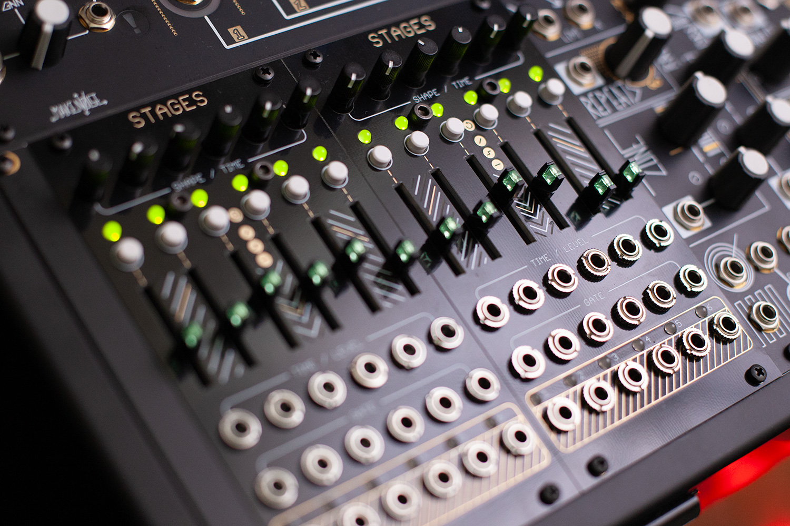

# MI Stages DIY

A guide to the firmware flashing and calibration process for DIY builds of Mutable Instruments Stages,
designed by Émilie Gillet.



While there is some minimal mention of the calibration process in the [official open-source docs](https://pichenettes.github.io/mutable-instruments-documentation/modules/stages/open_source/#calibration),
the exact details of how to go about this are lacking. Thus the creation of this guide.

Originally forked from [forestcaver/MIStagesStuff](https://github.com/forestcaver/MIStagesStuff) and updated with code fixes and 
improved/expanded instructions. The goal was to fill in the details from my own experience with building several of these, to make 
the process clearer and remove some of the guesswork.


## Useful Links

- [Stages Open Source
  docs](https://pichenettes.github.io/mutable-instruments-documentation/modules/stages/open_source/#)
- [Stages Manual](https://pichenettes.github.io/mutable-instruments-documentation/modules/stages/)
- [Stages code, hardware & panel design, and build BOMs](https://github.com/pichenettes/eurorack/tree/master/stages)


## What you'll need

- A (hopefully) successfully-built MI Stages board.
- A high-precision multimeter, for calibration. Standard multimeters used for basic electrical or automotive work probably 
  won't do; you ideally want something with more than two decimal places for precision VDC readings. I used an 
  `Extech MultiMaster MM560A`. If you don't have one, maybe you can rent or borrow something similar, or visit an
  electronics DIY workshop/meetup and ask to use one there.
- Something that can output precision voltages. I used an Ornament and Crime (o_C) module in References mode. Other modules
  may be able to do the same, such as a precision adder, Disting EX, or anything that can create stable voltage offsets of -1V
  and +2V. Or use some proper bench test equipment.
- A firmware programmer of some kind. I used the `STM32F051` Discovery board as recommended by Émilie. Some have used 
  a STLinkV2 successfully, others report issues with these with the newer MI stuff (Tides v2, Stages etc).
- Some jumper wires.
- A eurorack power supply and cable.
- A eurorack/mono 3.5mm cable.
- A computer with a USB port. Linux, Mac, or Windows should all work; anything that can run Virtualbox+Vagrant.
- Optionally: Something to view the Stages.brd file (supplied [here](https://github.com/pichenettes/eurorack/tree/master/stages/hardware_design/pcb)), 
  if needed for PCB troubleshooting. Autodesk Eagle, or Fusion 360 (it's new highly-bloated cloud subscription replacement, ew). 
  There may an open-source alternative, but as of this writing I couldn't actually get the .brd file to load or import in any of the ones I tried.
- Patience and some problem solving skills. Unlike earlier designs, the later MI modules were really not designed to be beginner-friendly for 
  personal/casual DIY work. These builds can either go smoothly, or be a multi-day troubleshooting project if 
  one microscopic 0402 resistor has an invisible cold joint or something, which can go unnoticed until you start trying
  to calibrate things and you get some unexpected voltages.


## Firmware and Calibration Steps

### Programmer Setup

On the Stages PCB, there is a place for a 4-pin header to the right of the STM32. This is the programming header, but 
it isn't really mentioned in Mutable's parts list BOM. You'll need to solder a 4-pin header to this. I just cut some
spare header to size. I also trimmed the leads so that they'll be flush with the opposite side of the PCB, so it doesn't
interfere with the placement of the sliders.

With the PCB upright, from top-to-bottom, the pins are `RESET`, `SWCLK`, `SWDIO`, and `GND`.

Plug in your firmware programmer into a USB port. I used a `STM32F051` Discovery board.

Use some jumper wires to connect the `RESET`, `SWDIO`, `SWCLK`, and `GND` pins on the Discovery board (at the
SWD header) to their equivalent pins on the Stages PCB (see the layout spec for your specific programmer to confirm which 
pin is which).


### Vagrant Environment Setup

Clone the [Mutable Instruments Vagrant Environment](https://github.com/pichenettes/mutable-dev-environment) and set
it up according to it's own instructions. 

Start the virtual environment with: 

```console
$ vagrant up
```


### Initial calibration edits

Clone the MIStagesDIY repo: 

```console
$ git clone git@github.com:edmondburnett/MIStagesDIY.git
```

Open up `settings.cc`. 

Look for the `#if 0` line that is below the comment `// Defaults`. These are some default starting values for the initial 
firmware flash. We'll later populate each of these values with our actual calibration data. For now, let's just apply 
the defaults by changing the `#if 0` line to `#if 1`, to enable the code block.

Copy settings.cc to the vagrant environment, replacing the original file located at `eurorack-modules/stages/settings.cc` 
with this one.

Now edit `factory_test.cc`. Look for the line with the comment that says `DAC Calibration`. Enable this by changing
`#if 0` to `#if 1`. Ignore the `ADC Calibration` section below it for now, and leave it disabled. Copy this file to 
`eurorack-modules/stages/factory_test.cc`, again overwriting the original.


### First firmware flashing

Plug in your programmer device's USB cable and power on the Stages eurorack power.

Log into the vagrant environment: 

```console
$ vagrant ssh
```

Check `lsusb`. You should see your programmer device listed here. 

```console
$ lsusb
```

If it's not listed, you may need to check your Virtualbox settings for the vagrant environment. Check the Ports 
tab and make sure USB Controller is enabled, and the programmer is listed and enabled under the USB device filters.

From the `eurorack-modules` directory, build the bootloader by running: 

```console
$ make -f stages/bootloader/makefile hex
```

Since Mutable Instruments is now shut down and no longer maintaining this code, some drift from it's dependencies is expected. If you get a 
compiler error regarding the STM library's decoder Init() being passed too many values, copy the supplied bootloader.cc file to 
`eurorack-modules/stages/bootloader/boatloader.cc` and recompile.

Build and flash the firmware (note that `upload` also erases any present firmware and calibration settings): 

```console
$ make -f stages/makefile upload
```

If the flashing fails, you might have an issue with the power supply, programmer header pin connections, or 
something with your build itself. Check especially for any bad solder joints on the STM32 pins.

If successful, you should see a continuous LED blinking sequence happening on the Stages. This means we're in 
calibration mode.


### DAC Calibration

Turn the 1st Shape/Time knob to zero. 

All six outputs should be trying to output a voltage of -1.0V (or something close to it). Confirm this with your multimeter. 
If you get zero or a wildly unexpected voltage on some of the outputs, there might be a build problem that needs troubleshooting before proceeding.

Take a measurement of each of the outputs with your multimeter and a 3.5mm audio cable, and add these values to each of the 
corresponding -1V rows in the `Stages_calibration.xls` spreadsheet, under the DAC section.

Now turn the first knob to full. All outputs should be trying to output 2V.

Measure all of the outputs again, and likewise enter these values into the spreadsheet in the 2V column, again under
the DAC section.

Now go back to the `settings.cc` file, and copy that whole previously-mentioned code block from `#if 1` to `#endif` and
paste it underneath. In the original one, change `#if 1` back to `if 0` to disable/ignore those defaults. We now want to
enable only our custom offset/scale values.

Now copy the values from the DAC `Offset` and `Scale` columns in the spreadsheet to the corresponding lines in the copied
code block, replacing the defaults. For example, the `offset` and `scale` for the first output jack gets assigned like the
following:

```cpp
persistent_data_.channel_calibration_data[0].dac_offset = 32688.0324252f;
persistent_data_.channel_calibration_data[0].dac_scale = -32208.2337488f;
```

And so forth, for the rest of the outputs. Of course, replace the values in the example with your own. I personally used 8 
decimal places, which should be good enough precision.


### ADC Calibration

In `factory_test.cc`, disable the DAC calibration mode by changing it's `#if 1` back to `#if 0`.

Below that section, enable the ADC calibration mode by changing it's `#if 0` to `#if 1`.

Clean and remove the previous build: 

```console
$ make -f stages/makefile clean
```

Recompile and re-flash the firmware, this time with ADC calibration mode enabled:
```console
$ make -f stages/makefile upload
```

Turn all knobs to zero.

Using something that can output precision voltages, apply -1V to each of the Time/Level inputs and record the output
values, this time adding them to the corresponding -1V cell in the ADC section of the spreadsheet. I used an Ornament
and Crime module in it's References mode for this purpose.

Apply +2V to each of the Time/Level inputs, and record the measurements again, for the ADC 2V column.

Back to the `settings.cc` file, update each of the ADC values with the `scale` and `offset` from the spreadsheet, like
we did earlier for DAC. For example, for the first output:

```cpp
persistent_data_.channel_calibration_data[0].adc_offset = 0.04197841f;
persistent_data_.channel_calibration_data[0].adc_scale = -0.99318016f;
```

Go to `factory_test.cc` again and disable the ADC calibration mode by switching the `#if 1` back to `#if 0`.

Build and flash the firmware again: 

```console
$ make -f stages/makefile clean
$ make -f stages/makefile upload
```

All done! Power cycle the module, rack it up and test it's functions.

